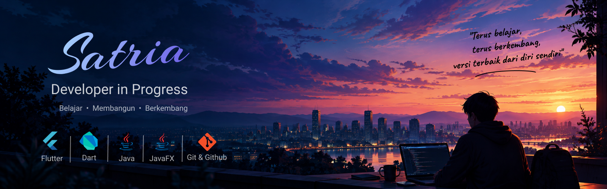

  

# Hai, saya Satria 👋

💻 Sedang belajar menjadi developer dan terus berkembang
🌱 Saat ini fokus belajar Flutter & Dart
🚀 Suka belajar lewat project dan mencoba hal baru

---

## 👨‍💻 Tentang Saya

Saya sedang belajar dunia pemrograman dengan membangun
project-project kecil dan mengembangkan kemampuan saya
secara bertahap.

Saat ini saya sedang fokus mempelajari Flutter untuk
membuat aplikasi dengan tampilan yang modern dan nyaman
digunakan.

Saya juga pernah mengembangkan project menggunakan Java
dan JavaFX, salah satunya adalah Dompetku.

---

## 🛠️ Teknologi

- Flutter
- Dart
- Java
- JavaFX
- Git & GitHub

---

## 🚀 Project

### 🏨 Roomly

Website pemesanan hotel yang saya buat menggunakan Flutter.

Project ini saya gunakan untuk belajar membuat tampilan
web yang modern, responsif, dan nyaman digunakan.

### 💰 Dompetku

Aplikasi pengelolaan keuangan pribadi menggunakan JavaFX.

Project ini menjadi salah satu project saya untuk belajar
Java, GUI, dan pengelolaan data.

---

## 📚 Saat Ini Saya Sedang Belajar

- Flutter & Dart
- Pengembangan Web
- UI/UX
- Git & GitHub

---

## 🎯 Tujuan Saya

Terus belajar, membuat lebih banyak project, dan berkembang
menjadi developer yang lebih baik.

---

## 📫 Temukan Saya

- GitHub: [satriamahatir357](https://github.com/satriamahatir357)
